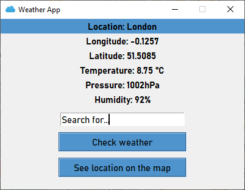
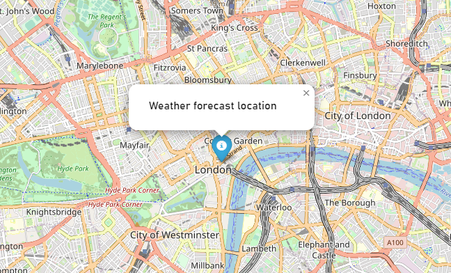

### Weather App
The Weather App is a simple Tkinter application that allows users to check the weather for a specified location and view the location on a map.
<p align="center">
    
</p>
<p align="center">
    
</p>

### Setup
1. Clone this repository or download ZIP file:
```
git clone https://github.com/emilian-klein/weather-app.git
```
2. Go to project directory.
3. Add your OpenWeather API key to the configuration.json file:
```
{
    "api_key": "your_openweather_api_key"
}
```
4. Install dependencies:
```
pip install -r requirements.txt
```
5. Run the application:
```
python weather_app.py
```