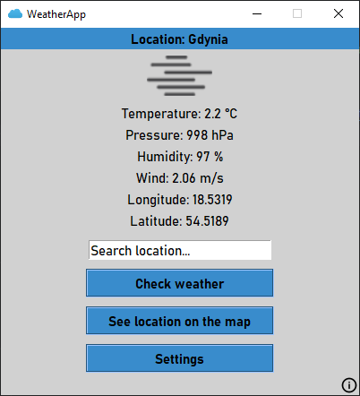
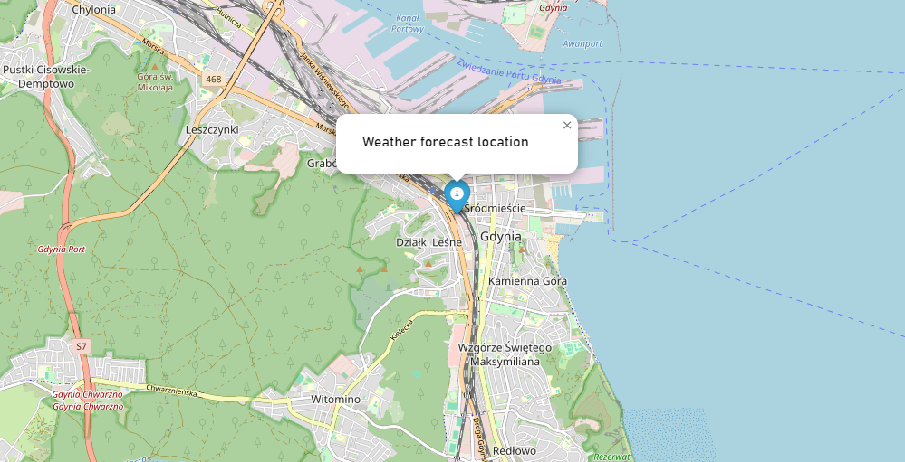
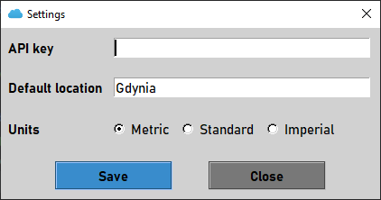

### WeatherApp
The WeatherApp is a simple Tkinter application that allows users to check current weather for a specified location and view the location on a map. 
Weather data is fetched from OpenWeather API.
<p align="center">
    
</p>
<p align="center">
    
</p>

### Required Python version
```
>=3.8.0
```

### Setup
1. Clone this repository or download ZIP file:
```
git clone https://github.com/emilian-klein/weather-app.git
```
2. Go to project directory.
3. Install dependencies:
```
pip install -r requirements.txt
```
4. Run the application:
```
python weather_app.py
```
5. Add your OpenWeather API key (https://openweathermap.org/appid) in the settings:
<p align="center">
    
</p>